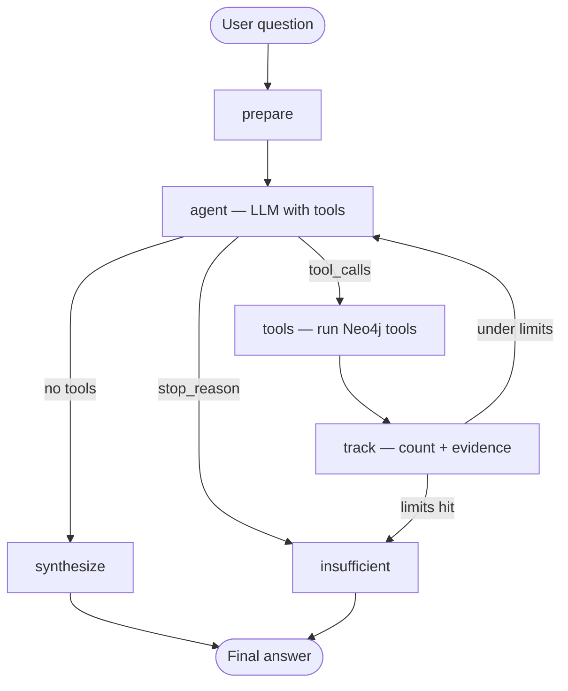

# Agent architecture — thought process

This document explains how the **graphAgent** reasoning layer works: why we use **LangGraph** and **LangChain**, how the agent loop is structured, which **tools** exist, and how we prevent runaway or hallucinated answers.

Implementation: [`graphAgent/`](../graphAgent/)

---

## Role of the agent in the stack

```
MongoDB (source of truth, raw blobs)
        │
        ▼  graphIngest (batch ETL, no LLM)
Neo4j (operational graph, distilled narratives)
        │
        ▼  graphAgent (LLM + curated tools)
User answer (cited, bounded, with token/cost trace)
```

The agent **does not** replace MongoDB or freely query it for every question. It reads the **graph** through fixed, schema-aligned tools. Mongo is wired only for outcome benchmark explanation and optional future drill-down.

**Why?**

- MongoDB agent (used in `analyzeData/` for discovery) is excellent for **schema exploration**, poor for **production legal Q&A** — unconstrained aggregation, large payloads, no graph traversal semantics.
- Curated Cypher behind tools is **testable**, ** repeatable**, and matches [`graph_schema.yaml`](../analyzeData/graph_schema.yaml).

---

## LangChain vs LangGraph — what each does here

| Layer | Library | Role in this project |
|-------|---------|----------------------|
| LLM integration | **LangChain** (`langchain-anthropic`, `langchain-core`) | `ChatAnthropic` model, tool binding, message types |
| Tool definitions | **LangChain** (`StructuredTool`, Pydantic schemas) | Typed tool inputs the LLM must populate |
| Orchestration | **LangGraph** (`StateGraph`, `ToolNode`) | Explicit workflow: prepare → think → tools → track → synthesize / stop |
| ReAct pattern | **LangGraph prebuilt** `ToolNode` | Standard tool execution loop |

We use **LangGraph** because a single `create_react_agent` call was not enough: we needed **hard limits**, **progress logging**, **token accounting**, and a separate **synthesis** step with its own prompt.

LangChain is the **component layer**; LangGraph is the **control flow**.

---

## Agent workflow (LangGraph graph)



### Nodes

| Node | Purpose |
|------|---------|
| **prepare** | Inject system prompt + user question; reset counters |
| **agent** | LLM decides which tools to call or whether to finish |
| **tools** | Executes Neo4j tools (`ToolNode`); logs tool name + args |
| **track** | Increments tool count, appends evidence, detects empty results, sets `stop_reason` |
| **synthesize** | Second LLM call (no tools) — writes final cited answer |
| **insufficient** | Structured “could not answer” when limits or empty evidence |

### State (`AgentState`)

Key fields beyond chat `messages`:

- `evidence` — JSON previews from each tool (audit trail)
- `tool_call_count`, `empty_streak`, `stop_reason`
- `token_usage` — input/output tokens + estimated USD cost
- `sufficient` — whether the run produced a confident answer

---

## Guardrails — why the agent stops

Configured in [`graphAgent/config/defaults.yaml`](../graphAgent/config/defaults.yaml):

| Limit | Default | Rationale (~70 cases) |
|-------|---------|------------------------|
| Max tool calls | 10 | Enough for search → overview → timeline; prevents loops |
| Max empty-result streak | 2 | Stop after repeated zero-row searches |
| Max outer iterations | 2 | Reserved for future re-planning; synthesis is single-pass today |

System prompt rules (see [`agent/prompts/system.py`](../graphAgent/agent/prompts/system.py)):

- Never invent `caseId`, compensation, or outcome bands
- Use `list_case_types` when taxonomy is unclear (`medical_negligence` ≠ `liability`)
- Prefer injury-specific tools for injury questions
- On failure: explain what was tried and what was missing

**Insufficient-data response** is a first-class outcome, not a bug.

---

## Tools — design philosophy

Tools are **not** open Cypher generation. Each tool wraps **reviewed Cypher** and returns **structured JSON** the LLM interprets.

### Why fixed tools instead of LLM-written Cypher?

| Fixed tools | Free-form Cypher |
|-------------|------------------|
| Predictable cost and shape | Easy to write expensive or wrong queries |
| Align with schema v1.2 | Model may hallucinate labels/relationships |
| Easier to test after ingest | Hard to regression-test |
| Safer for read-only production | Risk of destructive queries if misconfigured |

### Tool catalog

| Tool | Purpose |
|------|---------|
| `list_case_types` | Lists canonical `caseType` / `classifiedCaseType` values + counts — use before category search |
| `search_cases` | Filter by text, case type (with synonym expansion), outcome band, SLA |
| `get_case_overview` | Case header, parties, projection snapshot, injury fields, outcome |
| `get_case_outcome` | Explains deterministic `outcomeBand` + thresholds |
| `get_case_timeline` | Merges `RECEIVED_DOCUMENT`, `COMMUNICATED`, `ACTIVITY` chronologically |
| `get_outcome_benchmarks` | Compensation percentiles per case type |
| `search_injury_cases` | Injury-focused search (`mainInjury`, `injuredBodyParts`, `injurySearchText`, `caseSummary`); optional anchor case for similarity |
| `compare_injury_cases` | Side-by-side injury + outcome comparison; shared body parts |

### Tool design details worth mentioning

**Case type synonyms** ([`tools/case_types.py`](../graphAgent/tools/case_types.py))  
User language (“medical negligence”) ≠ stored snake_case (`medical_negligence`). Synonyms + normalization prevent false empty results.

**Edge merge keys (ingest, not agent)**  
Timeline tools assume one edge per communication/activity — fixed in ingest via `communicationId` / `activityId` merge keys.

**Outcome bands**  
Agent reads precomputed bands; `get_case_outcome` may pull Mongo projection to explain thresholds.

---

## Prompting strategy

Three prompts:

1. **SYSTEM_PROMPT** — graph model summary, rules, limits, taxonomy warnings  
2. **SYNTHESIZE_PROMPT** — final answer structure, Hebrew/RTL formatting hints for terminal  
3. **INSUFFICIENT_PROMPT** — honest failure template  

Temperature is **0** for reproducibility.

We separate **tool-calling** and **synthesis** so the final answer is prose with citations, not raw JSON dumps.

---

## Observability

CLI progress logs (stderr): step number, tool names, result counts.

Final stdout: answer + token line + path to `graphAgent/output/agent_run.json`.

Optional `--html` for RTL-friendly Hebrew rendering in a browser.

---

## What we deliberately did not build (v1)

| Omitted | Reason |
|---------|--------|
| Mongo drill-down tools in main loop | Keeps agent graph-first; adds latency and payload size |
| LLM-generated Cypher | Safety and consistency |
| Multi-user memory / sessions | Assignment scope — single question per run |
| Automatic case similarity (embeddings) | v2 — v1 uses structured filters + injury text overlap |
| Autonomous re-planning loop | `outer_iteration` reserved; current graph is single ReAct pass + synthesize |

---

## How to explain this in one minute

> We profiled MongoDB, designed a ** lean case-centric Neo4j graph** where events are edges not nodes, ingested it deterministically, then built a **LangGraph agent** that can only call **fixed Neo4j tools** aligned to that schema. The LLM plans and explains; the database answers with structured facts. Hard caps and deterministic outcome bands keep it auditable for a legal context.
